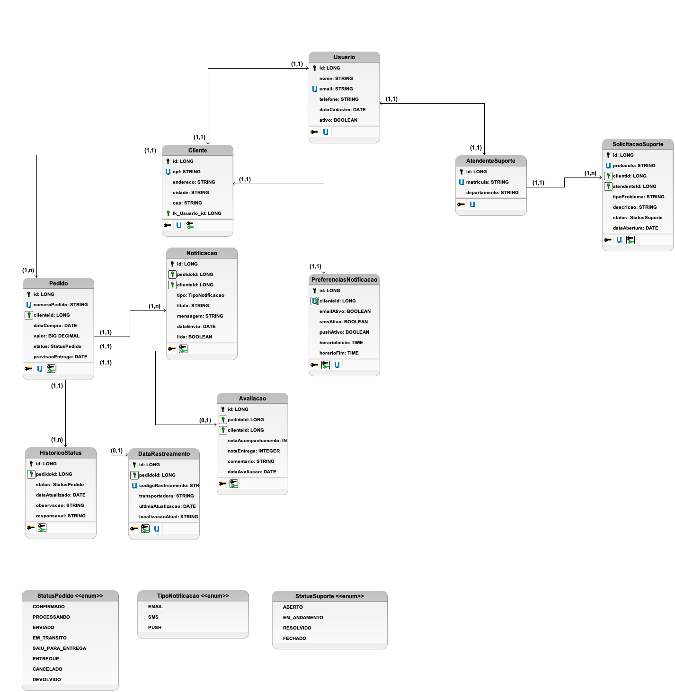

# Sistema de Acompanhamento de Pedidos - INFNET - PB TP3


Sistema desenvolvido como projeto prático para acompanhamento de pedidos e entregas, implementando conceitos de orientação a objetos e manipulação de arquivos CSV.

## Sobre o Projeto

Este projeto foi desenvolvido como parte do **TP3 - Projeto de Bloco: Desenvolvimento Back-end** do Instituto Infnet, implementando um sistema simulado de acompanhamento de pedidos que permite aos clientes visualizar o status de suas compras, avaliar experiências de entrega e gerenciar dados pessoais.

**Instituto Infnet** - Projeto de Bloco  
**Disciplina:** Desenvolvimento Back-end  
**Aluno:** Thiago Teodoro Peres

## Arquitetura

### Diagrama de Classes


O sistema foi modelado seguindo princípios de orientação a objetos, com separação de responsabilidades entre as camadas de modelo, controle e utilitários.

## Funcionalidades Implementadas

- **Sistema de Login/Logout** - Autenticação de clientes
- **Visualização de Pedidos** - Lista completa e detalhes individuais
- **Histórico de Status** - Acompanhamento em tempo real das mudanças
- **Filtros e Busca** - Por status, período e outros critérios
- **Avaliação de Entrega** - Sistema de feedback com notas e comentários
- **Compartilhamento** - Geração de links para compartilhar status
- **Gestão de Dados** - Importação/exportação via arquivos CSV
- **Atualização de Contato** - Modificação de dados pessoais

## Como Executar

### Pré-requisitos
- Java 8 ou superior
- Maven 3.8 ou superior

### Execução

1. **Clone e compile:**
   ```bash
   git clone https://github.com/thiagoperest/sistema-acompanhamento-tp3.git
   cd sistema-acompanhamento-tp3
   ```

2. **Execute a aplicação:**
   ```bash
   java -cp target/classes br.edu.infnet.Main
   ```

3. **Para usar com dados CSV:**
   ```bash
   java -cp target/classes br.edu.infnet.Main ./data
   ```

### Login de Teste
```
Email: joao@email.com
Senha: 123456
```

## Estrutura do Projeto

```
src/main/java/br/edu/infnet/
├── Main.java                    # Interface de linha de comando
├── controller/
│   └── SistemaAcompanhamento.java # Lógica principal do sistema
├── model/
│   ├── Cliente.java             # Dados do cliente
│   ├── Pedido.java              # Informações do pedido
│   ├── StatusPedido.java        # Status e histórico
│   └── Avaliacao.java           # Feedback do cliente
├── enums/
│   ├── TipoStatus.java          # Estados do pedido
│   ├── TipoCanal.java           # Canais de comunicação
│   └── TipoEvento.java          # Tipos de notificação
└── util/
    └── CSVHandler.java          # Manipulação de arquivos CSV

docs/
└── diagrama-de-classes.png     # Diagrama UML do sistema

data/                            # Diretório para arquivos CSV
├── clientes.csv
├── pedidos.csv
└── status.csv
```

## Arquivos CSV

O sistema trabalha com três tipos de arquivo:

**clientes.csv**
```csv
id,nome,email,senha,telefone,endereco
1,João Silva,joao@email.com,123456,(11) 99999-9999,Rua das Flores 123
```

**pedidos.csv**
```csv
id,numeroPedido,clienteId,dataCompra,valorTotal,codigoRastreamento,previsaoEntrega
1,PED-2025-001,1,2025-01-15T10:30:00,299.99,BR123456789,2025-01-20T18:00:00
```

**status.csv**
```csv
id,pedidoId,status,descricao,dataHoraAtualizacao,justificativa
1,1,EM_TRANSITO,Produto em trânsito,2025-01-16T14:20:00,Saiu do centro de distribuição
```

## Débito Técnico

### Sistema de Notificações
O sistema de notificações **não foi implementado** nesta versão e está planejado para o próximo TP.

## Casos de Uso Atendidos

- **UC01** - Visualizar Lista de Pedidos
- **UC02** - Visualizar Detalhes do Pedido
- **UC03** - Receber Notificações (Pendente para próximo TP)
- **UC05** - Avaliar Experiência de Entrega
- **UC06** - Fazer Login no Sistema
- **UC07** - Atualizar Dados de Contato
- **UC08** - Filtrar/Buscar Pedidos
- **UC09** - Compartilhar Status do Pedido

## Tecnologias Utilizadas

- **Java 17** - Linguagem principal
- **Maven** - Gerenciamento de dependências
- **Padrões MVC** - Organização do código

## Contato

**Thiago Teodoro Peres**  
Email: thiago.peres@al.infnet.edu.br  
Instituto Infnet - Desenvolvimento Back-end

---

**Projeto desenvolvido para o Instituto Infnet - TP3**